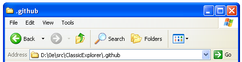

# Classic Explorer

Bring back a classic, XP-like feel to your File Explorer.



<sub>[Theme is Luna10 by vaporvance](https://www.deviantart.com/vaporvance/art/Luna10-907548273)</sub>

### Installation

Prebuilt binaries are currently not provided.

To install the DLL, navigate to the path and, in an administrator command prompt, run the following command:

```
regsvr32 ClassicExplorer.dll
```

To uninstall:
```
regsvr32 /u ClassicExplorer.dll
```

### Customization

To switch between the themes, or enable/disable the Go button/Address label, left click on the throbber. A popup menu with all the configuration options will be shown. After switching a option, open a new File Explorer window to see the changes.

### Credits

Thank you to [CyprinusCarpio](//github.com/CyprinusCarpio) for providing theme functionality and other customization features. These changes are lifted from [their fork](//github.com/CyprinusCarpio/ClassicExplorer).